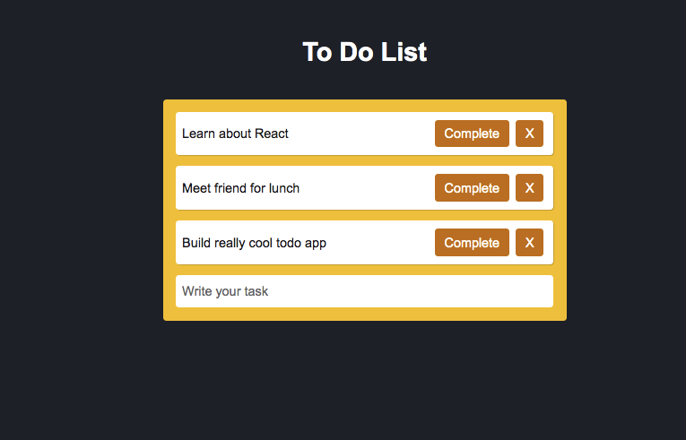

## Simple To Do app with hooks

Т.к. цель этого пирложение максимально простой to-do лист на один день. Для
практки реализовано 2 способа хранения тасков: в стейте и Local Storage,
которого достаточно для хранения пары задач на день.

### `npm start`

Runs the app in the development mode.  Open
[http://localhost:3000](http://localhost:3000) to view it in the browser.
